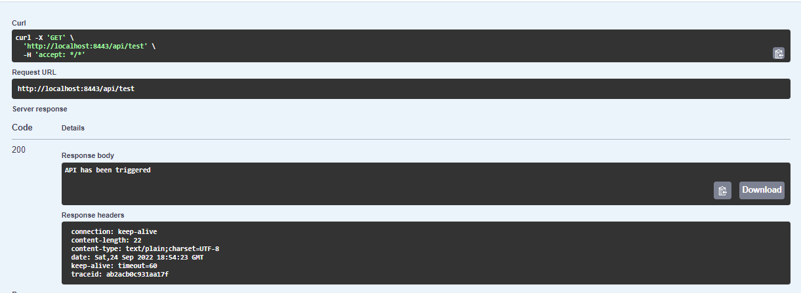

### DEPLOYING THE ASSIGNMENT TO DEV ENVIRONMENT🎉️

In order to run this project and experience some great features like tracing,logging and monitoring  
ensure you follow the steps below 

> * 🌟 Ensure Docker Runs on your Machine.
> * 🌟 Proceed to run the following
> * ``docker-compose -f docker-compose.dev.yml up -d``

### Monitoring Containers👀️

> 
⚠️⚠️ <b>Make Sure you share your email with me so i can add you to the datadog org so as to let you access the different metrics published by the system</b>️

We need to ensure that all 6 containers are up and running in order to begin testing

I decided to use DataDog to monitor the status of our containers in order to forsee any failures

You can proceed the same by using this link [DataDog Container Metric](https://app.datadoghq.eu/dash/integration/488/containers---overview?from_ts=1664044941581&to_ts=1664045241581&live=true).

### Getting Straight into Testing APIs

To Test the API please proceed to the following link [Swagger](http://localhost:8443/swagger-ui/index.html).

Once you run a request be sure to note down the TraceId that is placed in the Response Header.

### Why do we need this TraceId?😕

To get a feel of how your data was processed and the various steps it took to receive a response
I've integrated Kibana  alongside Datadog.

These two tools will help us log each and every event assocaited with your request.

Just Incase yo're prompted for an index use ``logstash*``

Once you have your traceId you can navigate to Kibana using the link below.

> http://localhost:5601/app/kibana#/discover?_g=(filters:!(),refreshInterval:(pause:!t,value:0),time:(from:now-5m,to:now))&_a=(columns:!(level,message),filters:!(('$state':(store:appState),meta:(alias:!n,disabled:!f,index:'290135e0-3c0d-11ed-a65f-29201d8ef3b8',key:container.name,negate:!f,params:(query:cosmos-service),type:phrase,value:cosmos-service),query:(match:(container.name:(query:cosmos-service,type:phrase))))),index:a0712710-3c4a-11ed-9ebe-ef69432d7655,interval:auto,query:(language:kuery,query:''),sort:!('@timestamp',desc))

After that input your traceId and press Enter to get a log history of your request

### Useful Links for monitoring 👍

[RAM and Network Usage of each Container](https://app.datadoghq.eu/dash/integration/488/containers---overview?from_ts=1664045854577&to_ts=1664046154577&live=true).

[Datadog Live Tail of Logs](https://app.datadoghq.eu/logs/livetail).

[Postgres Metrics](https://app.datadoghq.eu/dash/integration/58/postgres---metrics?from_ts=1664042813624&to_ts=1664046413624&live=true).

[Container Status](https://app.datadoghq.eu/containers).

#### Traces Related to Our Backend Service

[Over 90+ metrics related to our backend service can be found here Including each API latency](https://app.datadoghq.eu/metric/summary?p=2&tags=application%3Acosmos-backend%2Cenv%3Ajava-dev)

> **To search for a particular API latency Graph , use the m.api.* in your search filter**

### Finally Running Tests😄

Ensure you have maven and Docker(The database Container should be running even though we won't use it for testing.<TestContainers will be autogenerated>) Installed and run
``mvn test``

The reason we need Docker is that we are using TestContainers to Launch our Postgres test DB

> *PS: You're free to add custom dashboards once i invite you, just incase you're intrested😄*
